# bass-pixel-motion-content

Open content repository for Bass Pixel Motion scene shaders, video effects, schemas, and example project files.

Community: [Discord](https://discord.gg/XSnJwbnAhD) - [YouTube](https://www.youtube.com/@basspixelmotion)

## Showcases

GitHub-friendly preview gallery for rendered projects.
Each screenshot links to the generated MP4, and the metadata is sourced from the linked scene-shader manifest.

| Preview | Version |
| --- | --- |
| [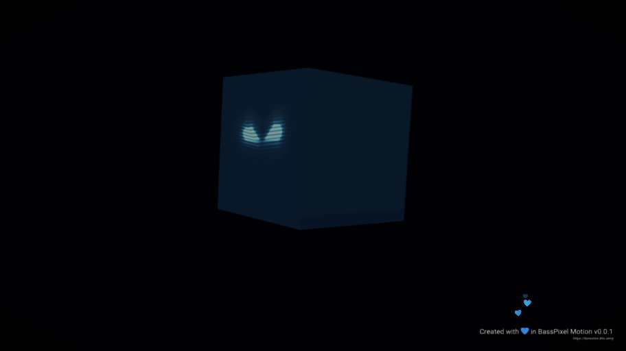](./show-cases/3d.mp4?raw=true) | `1.2.0` |
| [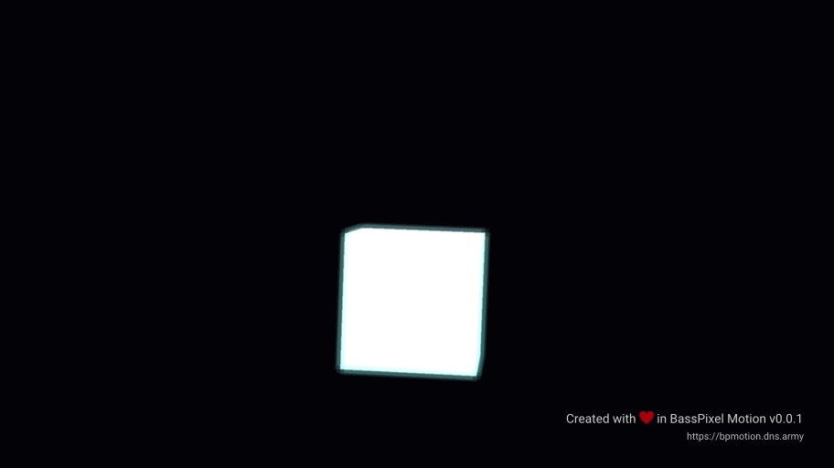](./show-cases/blenders-default-cube.mp4?raw=true) | `1.1.0` |
| [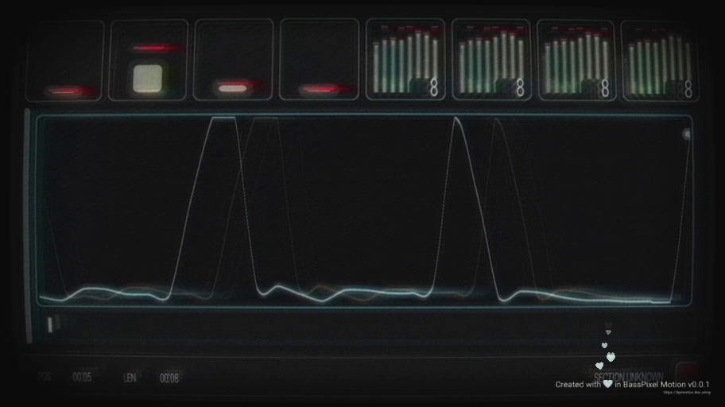](./show-cases/calibration.mp4?raw=true) | `1.0.0` |
| [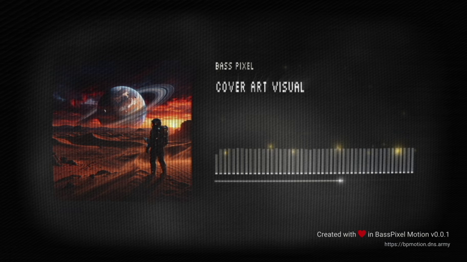](./show-cases/cover-art-visual.mp4?raw=true) | `1.0.0` |
| [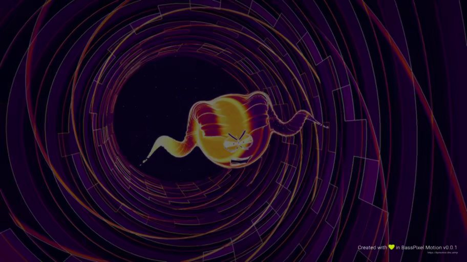](./show-cases/evil-raver.mp4?raw=true) | `2.0.0` |
| [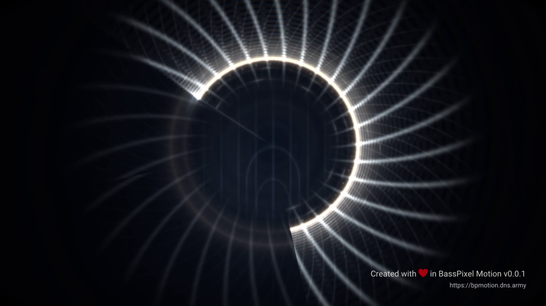](./show-cases/filigree-eclipse.mp4?raw=true) | `1.1.0` |
| [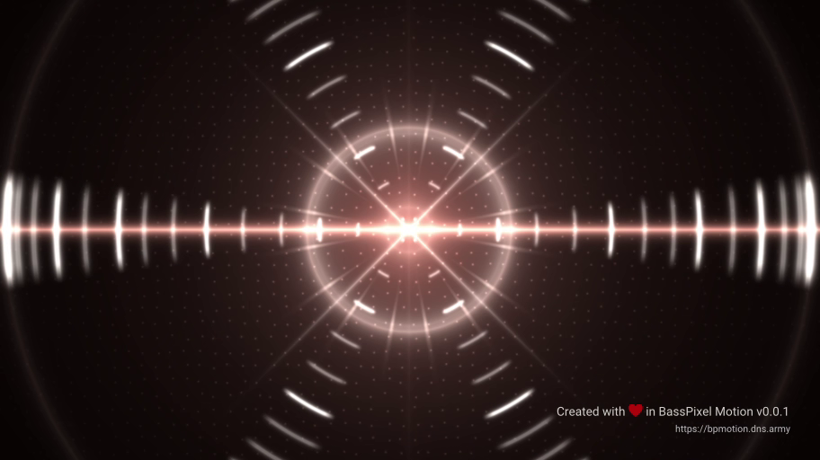](./show-cases/kinetic-corridor.mp4?raw=true) | `1.1.0` |
| [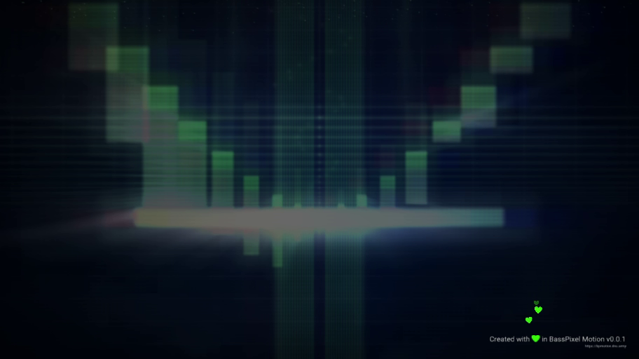](./show-cases/llama-pixel-motion-corridor.mp4?raw=true) | `1.1.0` |
| [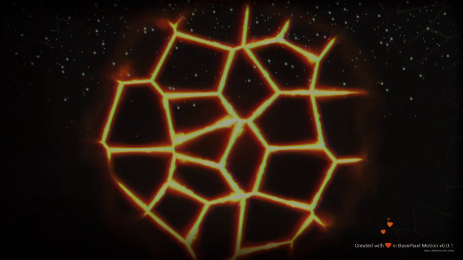](./show-cases/molten-crucible.mp4?raw=true) | `1.0.0` |
| [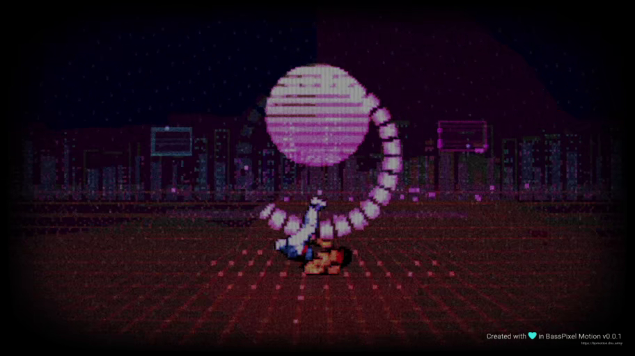](./show-cases/neon-kata-2049.mp4?raw=true) | `1.0.0` |
| [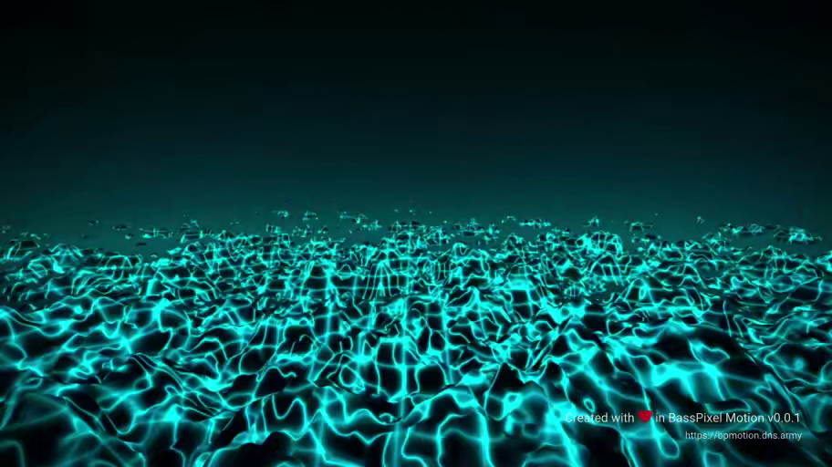](./show-cases/neon-landscape.mp4?raw=true) | `1.0.0` |
| [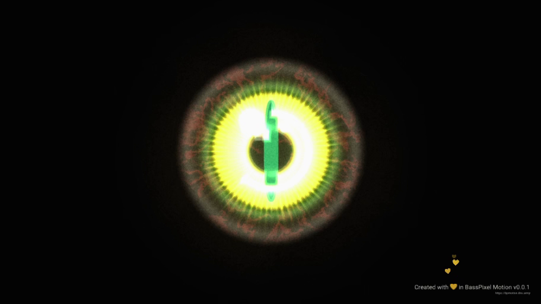](./show-cases/serpent-gate.mp4?raw=true) | `1.0.0` |
| [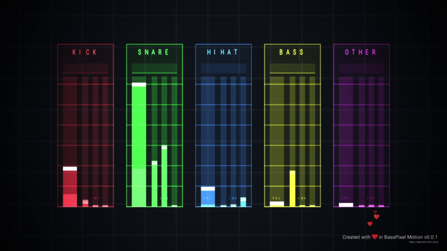](./show-cases/stem-analyzer.mp4?raw=true) | `1.0.0` |
| [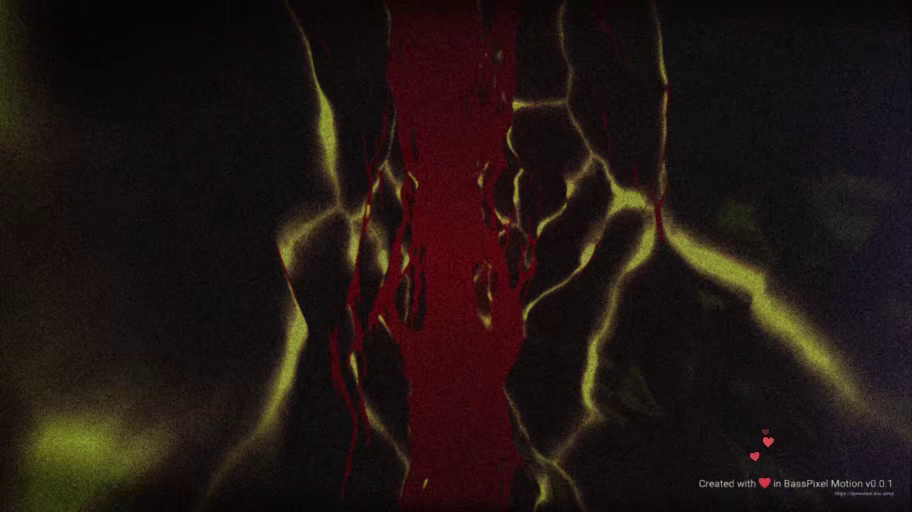](./show-cases/subterranean-pulse.mp4?raw=true) | `1.0.0` |
| [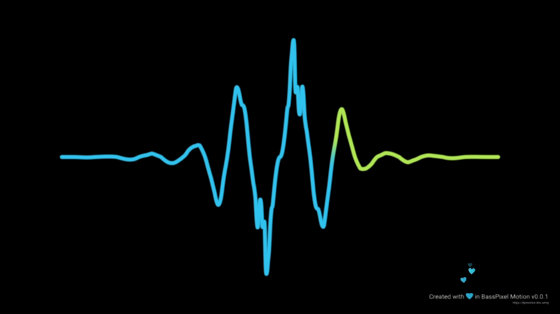](./show-cases/vocal-trace.mp4?raw=true) | `schema v1` |

The repository code and original content are licensed under MIT. See LICENSE.

Bundled third-party assets may have separate notice requirements. See license sidecar files in the 	hird-party directory.
